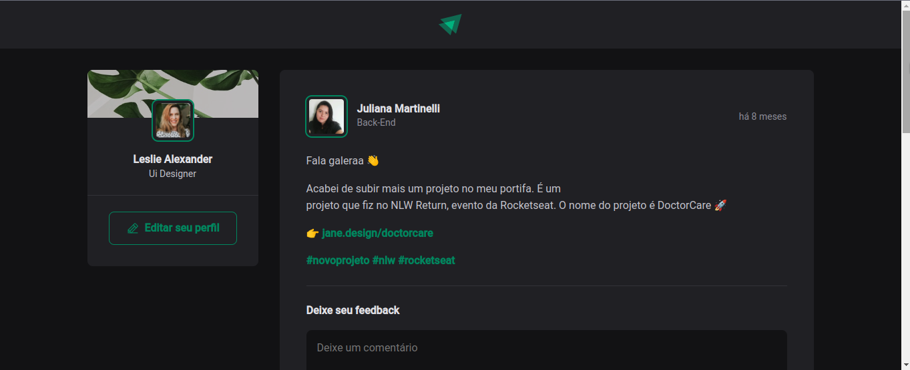

<div align="center" id="top"> 
  

&#xa0;

</div>

<h3 align="center">
    Ignite Feed
</h3>

<p align="center">
  <a href="https://rocketseat.com.br">
    
  </a>
  
  <a href="https://www.linkedin.com/in/dev-guilherme-aquino/">
    
  </a>
</p>

&#xa0;

## :rocket: Sobre o projeto

 <p align="center">
 
 </p>
 
Este é um projeto simples que simula o feed das redes sociais,
com funcionalidades de comentários, likes e apagar comentário.

## Funcionalidades

- Adicionar Comentários
- Apagar Comentários
- Aplaudir (likes)

&#xa0;

## Conceitos abordados

- Estados
- Componentização
- Imutabilidade do estado
- Propriedades
- Validação de formulário

&#xa0;

## 💻 Tecnologias

As seguintes ferramentas foram usadas na construção do projeto:

- [Node.js](https://nodejs.org/en/)
- [React](https://pt-br.reactjs.org/)
- [TypeScript](https://www.typescriptlang.org/)

&#xa0;

## :memo: Pré requisitos

Antes de começar, você precisa ter o [Git](https://git-scm.com) e o [Node](https://nodejs.org/en/) instalados em sua maquina.

&#xa0;

## :wrench: Começando

```bash
# Clone este repositório
$ git clone https://github.com/guiaquinodev/ignite-feed


# Entre na pasta
$ cd IGNITE-FEED-TS

# Instale as dependências
$ yarn

# Para iniciar o projeto
$ yarn start

# O app vai inicializar em <http://localhost:3000>
```

&#xa0;

## :thinking: Como contribuir

Se você deseja contribuir com o projeto, basta fazer um fork do repositório, criar uma branch com sua feature, fazer commit das alterações, fazer push para a sua branch e, quando o merge da sua pull request for realizado, deletar a sua branch.

&#xa0;

## 🔖 Layout

Você pode ver o layout do projeto [neste link](https://www.figma.com/community/file/1113573231685349036). É necessário ter uma conta no [Figma](https://figma.com) para acessá-lo.

&#xa0;

## ✔️ Licença

Este projeto está sob licença MIT. Veja o arquivo [LICENSE](LICENSE.md) para mais detalhes.

&#xa0;

<div align="center">
Feito com :heart: por <a href="https://github.com/guiaquinodev" target="_blank">Guilherme Aquino</a>
</div>
